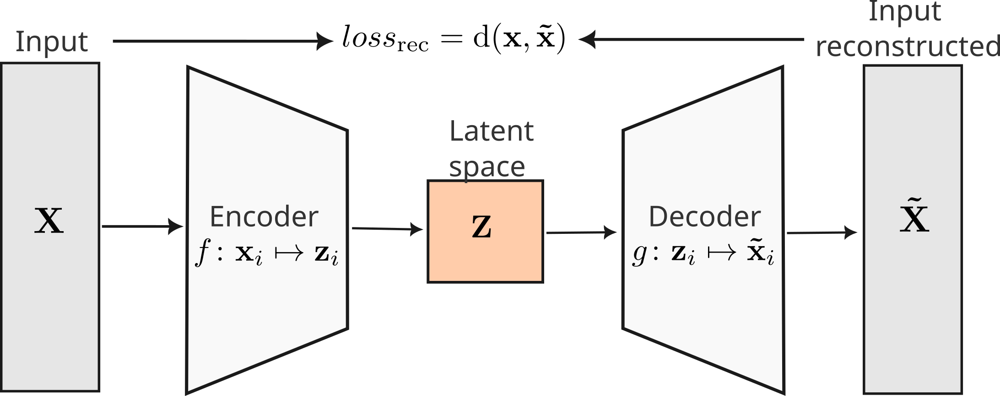

```{r setup, include=FALSE}
library(knitr)
library(xaringan)
options(htmltools.dir.version = FALSE)
opts_chunk$set(
  echo = FALSE, warning = FALSE, message = FALSE, comment = "#>",
  fig.path = "figure/", fig.align = "center", fig.height = 8.5,
  out.width = "100%", fig.show = "hold", fig.retina = 3,
  cache = TRUE, cache.path = "cache/"
)
katex <- function(latex) {
  paste0("$$", latex, "$$")
}
```

```{r xaringan-themer, include=FALSE, warning=FALSE}
library(xaringanthemer)
style_duo(
  primary_color = "#d5d5d2",
  secondary_color = "#728C81",
  text_color = choose_dark_or_light(
    "#D1C7A8", darken_color("#D1C7A8", 0.9),
    lighten_color("#537165", 0.99)
  ),
  text_font_family = "Latin Modern Sans",
  text_font_size = "1.2rem",
  header_font_family = "Latin Modern Sans",
  # code_font_family = "FiraCode Nerd Font"
  # header_font_google = google_font("Martel"),
  # text_font_google = google_font("Lato"),
  code_font_google = google_font("Fira Mono"),
  header_h1_font_size = "1.8rem",
  header_h2_font_size = "1.7rem",
  colors = c(
    red = "#f34213",
    purple = "#3e2f5b",
    orange = "#c46303f8",
    green = "#136f63",
    white = "#FFFFFF",
    gray = "#c9c9c9",
    bermellon = "#ebdbb2",
    black = "#020202",
    charcoal = "#8393A8",
    brownish = "#A89883",
    greenish = "#84a396"
  )
)
```

class: center, title-slide, inverse-slide

<style>
.title-slide .remark-slide-number {
  display: none;
}

.title-slide h1 {
font-weight: bold;
font-size: 50px;
color: #282828;
}

.title-slide h2 {
font-weight: bold;
font-size: 40px;
color: #282828;
}

.subtitle-slide h1 {
  font-weight: bold;
  font-size: 40px;
}

.inverse-slide {
  background-color: #84a396;
  color: #020202;
}


.black-slide {
  background-color: #393533;
  color: #B58322;
}

</style>

<style>
.remark-slide-content {
  font-size: 28px;
}

</style>

<style>

.center2 {
  margin: -1%;
  position: absolute;
  top: 72%;
  left: 51%;
  width: 240px;
  height: 128px;
  -ms-transform: translate(-50%, -50%);
  transform: translate(-50%, -50%);
}

.logo {
  position: absolute;
  top: 1em;
  right: 1em;
  width: 110px;
  height: 128px;
  z-index: 0;
}

.my-one-page-font {
  font-size: 20px;
}

</style>

<style>
blockquote {
    background-color: #afc0d5;
    /* font face italic */
    font-style: italic;
}
</style>

<style>
div.footnotes {
  position: absolute;
  bottom: 0;
  margin-bottom: 10px;
  width: 80%;
  font-size: 0.6em;
}
</style>

<script>
$(document).ready(function() {
  $('section:not(.backdrop):not(.title-slide)').append('<div class=\"footnotes\"></div>');

  // Use a regular expression to find and process your custom footnote syntax
  $('section').each(function() {
    var slide = $(this);
    var slideHtml = slide.html();

    slideHtml = slideHtml.replace(/\[\^(\d+)\]:\s*(.*?)\n/g, function(match, fnNum, text) {
      // Add the footnote text to the footnotes div
      var footnoteDiv = slide.find('div.footnotes');
      var existingFootnotes = footnoteDiv.html() || '';
      footnoteDiv.html(existingFootnotes + fnNum + '. ' + text + '<br/>');

      // Replace the footnote marker in the slide with a superscript number
      return '<sup>' + fnNum + '</sup>';
    });

    slide.html(slideHtml);
  });
});
</script>


# Discovering patterns in motion data using ~~supervised and~~ unsupervised models
# Emmanuel Alcalá
## CEIC, Universidad de Guadalajara

.center2[
```{r echo = FALSE}

```
]

---
class: middle

# The importance of measuring the spatial domain

--

Typically, experiments measure behavior subject to two constraints:

--

* a set of discrete responses predefined by the experimenter

--

* a particular experimental paradigm or tradition that dictates, more or less, what is important to measure

--

These two constraints, in turn, are restricted by the space of possibilities that technology allows.

---
class: middle

# The importance of measuring the spatial domain

The study of learning and behavior began in *space* (e.g., mazes, open field, etc).

--

With the invention of the operant conditioning chamber, the experimental study of behavior focused on time (interruptions of switches per unit of time, to be precise).

--

The limitations of not measuring the (3) spatial dimension of behavior have been recognized. For example, Davison (2018) describes an experiment by Alsop (1987) where pigeons were unable to discriminate between two magnetic fields. However, Mora et al (2004) achieved discrimination when they allowed pigeons to *walk*.

---
class: middle

<blockquote>
But behavior in the one dimension of time cannot properly and fully simulate behavior in time plus the additional 3 dimensions of space, because time is unidirectional and space is bidirectional. 
.right[-- <cite>Michael Davison, 2018</cite>]
</blockquote>

--

To the extent that behavior occurs in space and time, the importance of studying the spatial dynamics of behavior remains an empirical question.

---
class: middle

--

However, acknowledging it is not enough. Measuring behavior continuously in space increases the number of dimensions, which has long been a technical problem.

--

Here we illustrate a workflow that makes use of recent developments in ML that could help solve these problems.

--

We just explored a class of learning models called *unsupervised* models. These models are used to discover patterns in data without the need for a predefined labels.

---
class: middle

## Workflow

```{r, echo=FALSE, fig.align='center', out.width='80%'}

```
---
class: middle

## Data

Data comes from Campos-Ordonez et al (2022). The positional data of mice exposed to Cyclohexane and non-exposed mice was obtained using DeepLabCut (Mathis et al, 2018). Nine bodyparts were tracked: nose, left ear, right ear, neck, middle back, tail base, and three points along the tail.

```{r, echo=FALSE, fig.align='center', out.width='50%'}

```
---
class: middle

Example of reconstruction of a mouse's trajectory using estimated poses with DLC.

```{r, echo=FALSE, fig.align='center', out.width='70%'}

```
<!-- 
 -->

---
class: middle

## Feature engineering

Let $\boldsymbol{\gamma}_i(t)=(x_i(t), y_i(t))$ for bodypart $i$ at time $t$. The following features were obtaining from the positional data:

```{r, echo=FALSE, fig.align='center', out.width='60%'}

```
---
class: middle

## Embedding using a variational autoencoder

--

A variational autoencoder (VAE) is a generative model that learns a latent space $\mathbf{Z}$, low-dimensional representation of the data that captures the most important features, from $\mathbf{X}$. 

--

The VAE is trained to reconstruct the data $\mathbf{\tilde{X}}$ from the latent space, a probability distribution that is assumed to be a multivariate normal distribution.

```{r, echo=FALSE, fig.align='center', out.width='60%'}

```

---
class: middle

## Behavioral segmentation using a hidden Markov model

--

From the latent space (or directly with the features), we can use a hidden Markov model to segment the data into behavioral states. 

--

A hidden Markov model is a generative model that assumes that the data is generated by a Markov process with hidden states. The hidden states are not directly observable, but the data is. The hidden states are assumed to be a Markov process, i.e., the probability of being in a state at time $t$ depends only on the state at time $t-1$.

---
class: middle

# Results

## HMM with kinematic features as input

We were able to segment the data in three states using the kinematic features as input to the HMM. Ordering the mean speed or acceleration features by states we can see three modes of locomotion: stop (with micromovements), slow, and fast. However, we were not able to identify some clear patterns like circling.

```{r, echo=FALSE, fig.align='center', out.width='50%'}

```
---
class: middle

## HMM with VAE latent space as input

Using the latent space of the VAE as input to the HMM, we were able to identify several states, two on which included circling

For visualization, because the latent space is still high-dimensional, we used UMAP to reduce the dimensionality to 2D.

UMAP is a non-linear dimensionality reduction algorithm that preserves the global and local structure of the data.

---
class: middle, black-slide

Left is UMAP embedding of the latent space of the VAE colored by state from HMM. A dot point is showing the state-space trajectory of a mouse. 

<div style="display: flex;">
  <div style="flex: 3;">
    <video width="90%" height="90%" controls id="my_video">
      <source src="img/umap_states_vame_first.mp4" type="video/mp4">
    </video>
  </div>
  <div style="flex: 1; text-align: center;">
    <p>Minuto 2</p>
  </div>
</div>

<div style="display: flex;">
  <div style="flex: 3;">
    <video width="90%" height="90%" controls id="my_video">
      <source src="img/umap_states_vame_circling.mp4" type="video/mp4">
    </video>
  </div>
  <div style="flex: 1; text-align: center;">
    <p>Minuto 17</p>
  </div>
</div>

---
class: middle

## What's next

--

* Exploring other models (LSTM, AR-HMM, etc).
* Fine tune the VAE.
* Validate the model and the states with trained observers.

---
class: middle

.center[
  # Gracias
.content-box[jealcalat@gmail.com]
]
